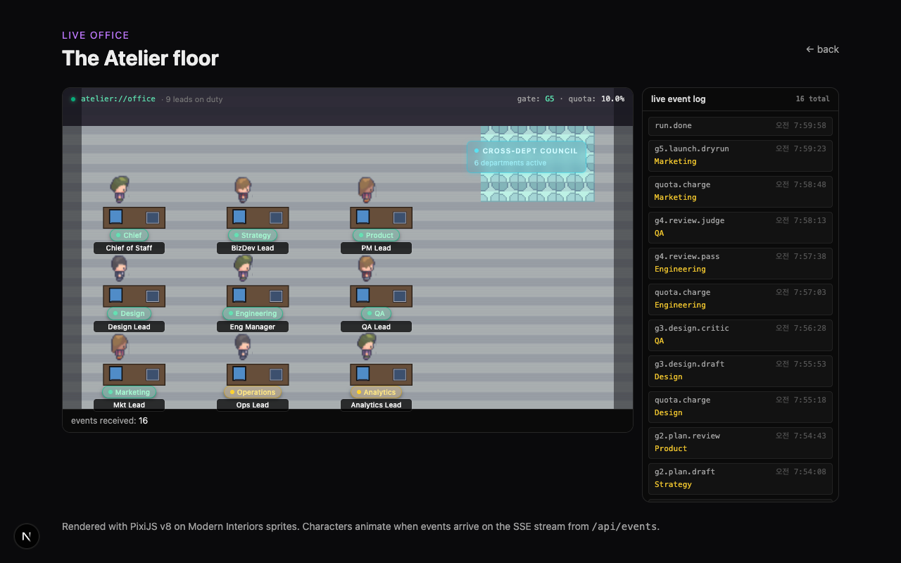
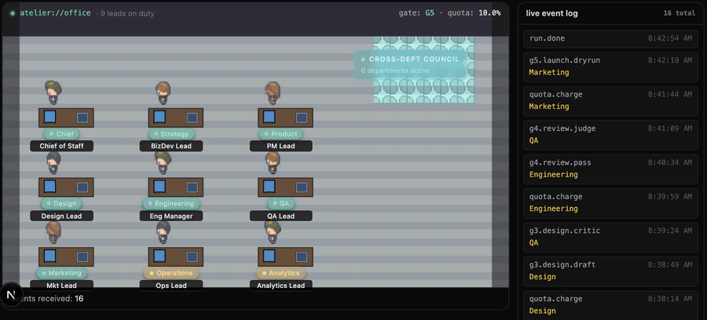
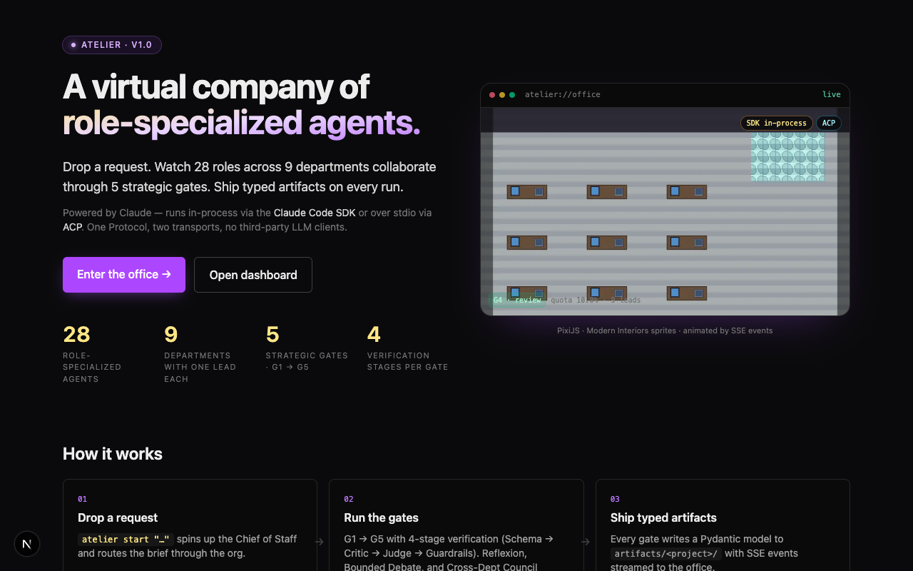
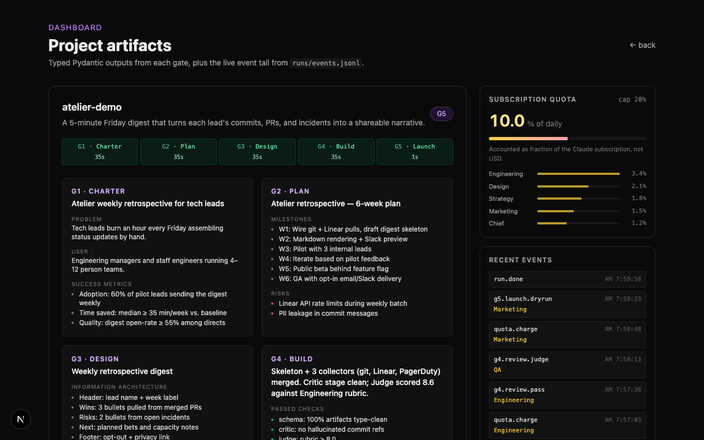

<div align="center">

# Atelier

**Virtual company of role-specialized agents.**
A Python framework that orchestrates 28 LLM-driven roles across 9 departments through 5 strategic gates (G1–G5), shipping typed artifacts on every run.

[](https://www.python.org/)
[](#license)
[](#)

**English** · [한국어](README.ko.md)

</div>



> **Live action** — particle trails from the Chief of Staff to each dept lead trigger as events arrive on the SSE stream:
>
> 

---

## Overview

Atelier models a software company as a directed graph of role-specialized agents. A single user request enters as an inbox file, flows through five strategic gates — **Charter → Plan → Design → Build → Launch** — and exits as a folder of typed, schema-validated artifacts plus a launch memo.

Two LLM transports are supported, both already shipping:

1. **Claude Code SDK in-process** — uses `claude-agent-sdk`, sharing the user's Claude Pro/Max subscription via browser OAuth.
2. **ACP (Agent Client Protocol)** — speaks JSON-RPC over stdio to any ACP-compatible agent (Claude Code ACP, Gemini ACP, Codex CLI).

All callers depend on a single `LLMProvider` Protocol — these two are the only implementations.

## Features

- **9 department leads** (Opus 4.7) + **19 specialists** (Sonnet 4.6), defined as composable `Role` objects, with a **Role Foundry** (R38) that dynamically hires typed `RoleSpec` instances against capability `Requisition`s — pilot live in G3, seed corpus and hired specs cached under `runs/memory/org/role_corpus.json`.
- **5 strategic gates** wired as a LangGraph with optional SQLite checkpointing.
- **4 decision protocols, all wired into the runtime** — Reflexion retries (per-gate, capped, critique injected into the next attempt), Bounded Debate in G2/G3/G4 (UX+UI / PM Specialist+Market Researcher / Tech Lead+Security challenge the lead), end-of-run Cross-Dept Council (5 leads vote, PM Lead tie-break), per-run Janitor Memo persisted to `runs/`.
- **4-stage verification** — Schema (Pydantic) → Critic (deterministic) → Judge (LLM rubric) → Guardrails (PII/secrets).
- **3-tier memory with recall** — Org (read-only) / Project (shared) / Role (self-edit, with each lead's prior-run facts injected into the next gate prompt).
- **Subscription-quota budget** — fraction-based accounting (`QuotaGuard`), not USD per token.
- **MCP tool registry** — 13 servers mapped to departments out of the box.
- **Optional integrations** — Langfuse tracing, Temporal durable workflows, E2B sandboxed code execution.
- **Web dashboard** — Next.js 16 + React 19. PixiJS office view (Modern Interiors sprites) shows each lead's specialist count and pulses on `specialist.*.challenge`. `/dashboard` aggregates verify ✓/✗, reflexion retries, judge rubric averages, and the latest Cross-Dept Council ballot straight from `runs/events.jsonl`. Active runs can be started and cancelled from the UI.
- **Claude Code plugin** — slash commands for gate approval inside Claude Code.

## Installation

```bash
git clone https://github.com/Seungwoo321/atelier.git
cd atelier
uv venv && source .venv/bin/activate     # or: python3.12 -m venv .venv
uv pip install -e ".[dev]"

# First-time browser OAuth for Claude subscription:
atelier auth login
```

Python 3.12+ required.

## Quick Start

```bash
# Drop a request, run all five gates, print the resulting artifact tree:
atelier start "weekly retrospective CLI for solo developers"

# List queued inbox items:
atelier inbox list

# Approve a gate card (Phase A: file-flag based):
atelier inbox approve ./inbox/20260101-120000-request.md

# Inspect available MCP tools for a department:
atelier mcp list --department Engineering

# Show last result:
atelier result
```

Artifacts land in `./artifacts/<project_id>/result.json`. Run logs and the SQLite checkpoint live in `./runs/`.

A CLI walkthrough:


## Environment

Copy `.env.example` to `.env` and adjust:

| Variable | Default | Meaning |
| --- | --- | --- |
| `ATELIER_LLM_PROVIDER` | `sdk` | `sdk` (in-process) or `acp` |
| `ATELIER_ACP_ENDPOINT` | — | ACP agent command line (when provider=`acp`) |
| `ATELIER_QUOTA_CAP` | `0.20` | Daily quota fraction (0.0–1.0) |
| `ATELIER_ARTIFACTS_DIR` | `./artifacts` | Where artifacts are written |
| `ATELIER_INBOX_DIR` | `./inbox` | Where inbox markdown files live |
| `ATELIER_RUNS_DIR` | `./runs` | Logs + SQLite checkpointer |
| `ATELIER_LOG_LEVEL` | `INFO` | Structured log level |
| `ATELIER_VERIFY_ENABLED` | `true` | Run Schema → Critic → Guardrails after every gate |
| `ATELIER_JUDGE_ENABLED` | `false` | LLM-as-judge stage (doubles per-gate quota) |
| `ATELIER_JUDGE_THRESHOLD` | `0.70` | Minimum rubric score required to pass judge |
| `ATELIER_REFLEXION_CAP` | `1` | Retry attempts when Critic fails (0–3) |
| `ATELIER_SPECIALIST_DEBATE_ENABLED` | `false` | Dispatch UX + UI Designer specialists in G3 |
| `ATELIER_COUNCIL_ENABLED` | `false` | End-of-run Cross-Dept Council vote on launch readiness |
| `ATELIER_ROLE_MEMORY_ENABLED` | `true` | Inject each lead's prior-run facts into their gate prompt |
| `ATELIER_ROLE_MEMORY_MAX_FACTS` | `5` | Most-recent facts per role to include (0–20) |
| `ATELIER_FOUNDRY_ENABLED` | `false` | Issue G3 specialist seats as capability Requisitions through the Role Foundry (cache + Talent Lead hire) instead of fixed seats |

Optional integrations: `LANGFUSE_PUBLIC_KEY`/`LANGFUSE_SECRET_KEY`, `TEMPORAL_HOST`, `E2B_API_KEY`.

## Project Layout

```
atelier/
├── atelier/                  # Python package
│   ├── cli.py                # Typer entry point
│   ├── config.py             # Pydantic Settings
│   ├── runner.py             # High-level run engine
│   ├── budget.py             # QuotaGuard
│   ├── inbox.py              # ./inbox/*.md ops
│   ├── llm/                  # LLMProvider Protocol + SDK & ACP
│   ├── roles/                # 9 leads + specialists catalog
│   ├── artifacts/            # Pydantic schemas per gate
│   ├── graph/                # LangGraph wiring + G1–G5 gates
│   ├── protocols/            # Reflexion, Debate, Council, Janitor
│   ├── verify/               # 4-stage verification
│   ├── memory/               # Org / Project / Role tiers
│   ├── mcp/                  # MCP server registry
│   ├── observability/        # structlog + Langfuse
│   ├── durable/              # Temporal client wrapper
│   ├── sandbox/              # E2B + local fallback
│   ├── eval/                 # Eval Officer + DEPT_RUBRICS
│   └── plugin/               # Claude Code plugin
├── web/                      # Next.js 16 + React 19 dashboard
├── assets/                   # Modern Interiors sprites (free version)
├── tests/
└── .claude/                  # Project memory + rules for Claude Code
```

## The 9 Departments

| # | Department | Lead | Specialists |
| --- | --- | --- | --- |
| 1 | Strategy | BizDev Lead | Market Researcher, Competitor Analyst, BM Modeler |
| 2 | Product | PM Lead | PM Specialist, Product Designer |
| 3 | Design | Design Lead | UX, UI, Brand Designer |
| 4 | Engineering | Eng Manager | Tech Lead, FE, BE, Infra, DB, Security, DevOps |
| 5 | QA | QA Lead | Test Engineer, Bug Hunter |
| 6 | Marketing | Mkt Lead | Content Writer, SEO, Growth, Social |
| 7 | Operations | Ops Lead | Customer Support, Community Manager |
| 8 | Analytics | Analytics Lead | Data Analyst, Financial Modeler |
| 9 | Chief | Chief of Staff | Memory Keeper, Eval Officer |

Model tier: leads and Chief group → Opus 4.7; specialists → Sonnet 4.6; runtime utility tasks → Haiku 4.5.

## The 5 Gates

```
inbox/*.md
   │
   ▼
G1 Charter ──► G2 Plan ──► G3 Design ──► G4 Build ──► G5 Launch ──► artifacts/
   │              │             │             │            │
   └──────────────┴── 4-stage verify (Schema → Critic → Judge → Guardrails) ───────────┘
```

Each gate produces a typed Pydantic artifact (`ProductCharter`, `Plan`, `PRD` + `DesignMemo`, `CodeReview`, `LaunchMemo`). A failing verification stage triggers Reflexion (up to 3 iterations) before escalating to a Cross-Dept Council.

## Web Dashboard

The `web/` directory ships a Next.js 16 + React 19 dashboard with a PixiJS-rendered office view (Modern Interiors tilemap). Start it with:

```bash
cd web
pnpm install
pnpm dev
```

Open <http://localhost:3000>. The landing page is at `/`, the live office at `/office`, and the run summary at `/dashboard`.

| Route | Preview |
| --- | --- |
| `/` — landing |  |
| `/office` — live office |  |
| `/dashboard` — run summary |  |


Want the office and dashboard populated before your first real run? Seed a sample run:

```bash
python scripts/seed_demo.py
```

This writes `artifacts/atelier-demo/` (5 typed gate outputs) and `runs/events.jsonl` (16 events covering G1 → G5). Both directories are git-ignored as runtime state.

## Claude Code Plugin

Place `atelier/plugin/` on your Claude Code plugin path or invoke it via the bundled slash commands (`/atelier-start`, `/atelier-approve`). See `atelier/plugin/README.md`.

## Development

```bash
uv pip install -e ".[dev]"
ruff check .
mypy atelier
pytest
```

## License

Proprietary — internal use only. Modern Interiors sprite assets bundled under `assets/modern-interiors/` are © LimeZu and redistributed under the *free version* license (non-commercial use only). See `assets/modern-interiors/LICENSE.txt`.
